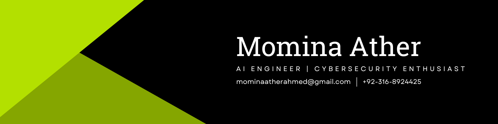

<!-- ============== HEADER — your LinkedIn banner (host it in your repo) ============== -->
<p align="center">
  
</p>

<p align="center">
  <a href="https://mominaportfolio.netlify.app/"></a>
  <a href="https://www.linkedin.com/in/momina-ather/"></a>
  <a href="https://www.kaggle.com/mominaather"></a>
  <a href="https://medium.com/@mominaatherahmed"></a>
</p>

<p align="center">
  
</p>

---

<!-- ============== 01 — ABOUT ============== -->
## ✦ &nbsp;`01` &nbsp;About Me

I build intelligent systems that don't just *think* — they **defend**. 🛡️

I'm an **AI Engineer** specializing in **LLMs, RAG, Voice AI, and Computer Vision**, now channeling all of it into **AI-native security** at **Cloudtenants**. My work lives where applied machine learning meets real-world deployment — from agentic systems that reason on their own to CV models that spot threats in real time.

```
  🤖  AI Engineer @ Cloudtenants — extending AI into cybersecurity
  🧠  LLMs · RAG · Agentic AI · Voice AI · Computer Vision
  🛡️  Threat detection · Anomaly detection · Liveness · OSINT
  ✍️  Writing about AI on Medium · Open-source on GitHub & Hugging Face
```

> *The next wave of security isn't bolted on — it's intelligent, adaptive, and built in.*

---

<!-- ============== 02 — ARSENAL ============== -->
## ✦ &nbsp;`02` &nbsp;The Arsenal

> I love a good stack tag — here's the full toolkit, grouped by domain. 🧰

**🤖 &nbsp;AI · LLMs · GenAI**
<p>
  
  
  
  
  
  
  
  
  
  
  
</p>

**👁️ &nbsp;Computer Vision · Voice**
<p>
  
  
  
  
  
  
</p>

**🛡️ &nbsp;AI · Security Focus**
<p>
  
  
  
  
  
  
  
  
  
  
</p>

**⚙️ &nbsp;Backend · Web**
<p>
  
  
  
  
  
  
  
</p>

**🗄️ &nbsp;Data · Databases · Vectors**
<p>
  
  
  
  
  
  
  
  
</p>

**☁️ &nbsp;DevOps · Cloud · Viz · Automation**
<p>
  
  
  
  
  
  
  
  
  
  
</p>

---

<!-- ============== 03 — CURRENTLY BUILDING ============== -->
## ✦ &nbsp;`03` &nbsp;Currently Building

| Focus | What's cooking |
| :---- | :------------- |
| **🛡️ AI-Native Security** | Systems that detect, respond & adapt to evolving threats |
| **🎙️ Real-Time Voice Agents** | Full-duplex voice LLMs that chat like humans |
| **✨ GenAI Experiments** | RAG + agentic flows with Llama & Gemini |
| **👁️ Computer Vision** | YOLOv8 for threat, anomaly & liveness detection |
| **☁️ Cloud Deployments** | Firebase + AWS shipping AI apps in real time |

---

<!-- ============== 04 — FEATURED WORK ============== -->
## ✦ &nbsp;`04` &nbsp;Featured Work

| Project | Stack | What it does |
| :------ | :---- | :----------- |
| **🎙️ Real-Time Voice AI Agent** | `Python` · `Deepgram` · `Cartesia` · `OpenAI` | Listens, reasons & speaks — full-duplex voice AI with sub-second latency in production. |
| **💬 Bilingual AI Chatbot** | `Flask` · `OpenAI` · `Whisper` · `TTS` | Urdu + English assistant with live voice, transcription & speech — bridging language barriers. |
| **🏥 AI Medical Diagnostic System** | `YOLOv8` · `LLaMA-3` · `Django` · `Firestore` | Appendicitis diagnosis via LLaMA-3 chatbot, decision-tree analysis & ultrasound CV, with auto reports. |
| **📄 QueryWise — RAG Document Q&A** | `RAG` · `LangChain` · `Pinecone` · `Groq` | Natural-language querying over PDF/Word/Excel/PPT via HuggingFace embeddings + Pinecone + Groq. |

<p align="center">
  <a href="https://mominaportfolio.netlify.app/projects"></a>
</p>

---

<!-- ============== 05 — GITHUB STATS ============== -->
## ✦ &nbsp;`05` &nbsp;By the Numbers

<p align="center">
  
  
</p>

<p align="center">
  
</p>

---

<!-- ============== 06 — KAGGLE ============== -->
## ✦ &nbsp;`06` &nbsp;Kaggle Badges

<p align="center">
  
  
  
  
  
  
  
  
  
  
  
  
</p>

---

<!-- ============== 07 — CONNECT ============== -->
## ✦ &nbsp;`07` &nbsp;Let's Build Something

<p align="center">
  <a href="https://mominaportfolio.netlify.app/"></a>
  <a href="https://www.linkedin.com/in/momina-ather/"></a>
  <a href="https://github.com/momina02"></a>
  <a href="https://www.kaggle.com/mominaather"></a>
  <a href="https://medium.com/@mominaatherahmed"></a>
  <a href="mailto:mominaatherahmed@gmail.com"></a>
</p>

<p align="center">
  <b>⚡ Open to collabs on AI, LLMs, automation & AI-native security.</b><br/>
  <i>Drop a message — let's build something resilient & intelligent.</i>
</p>
