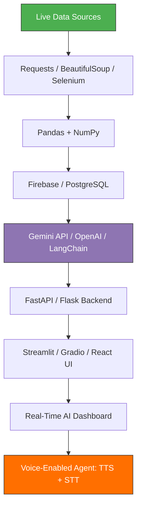

# Hi there! 👋 I'm Momina  

### 🚀 **Machine Learning Engineer | AI Engineer | Python Developer**


- **🔍** **Decoding the world’s data** — pulling live insights from **OECD, World Bank & SBP APIs** like a digital oracle  
- **📊** **Obsessed with turning chaos into clarity** — **predictive models**, **real-time automation**, and **AI that thinks ahead**  
- **💡** **Engineering full-stack intelligence** — from **scraping the web** to **deploying voice-powered LLMs** with **Gemini, Llama & Vanna**  

---

### 🔧 **Tech Stack & Skills**

| **Domain** | **Skills & Tools** |
|------------|---------------------|
| **Programming & Web** | `Python` `JavaScript` `React` `HTML/CSS` `Tailwind CSS` `Django` |
| **Machine Learning** | `Scikit-learn` `TensorFlow` `PyTorch` `YOLOv8` `OpenCV` `Time-Series (LSTM, Prophet)` `GMM & Clustering` |
| **AI & LLMs** | `OpenAI (GPT-4o, o1)` `Google Gemini` `Llama / Mistral` `LangChain` `LlamaIndex` `RAG Pipelines` `Vanna (SQL → AI)` `Agentic AI` |
| **Speech & Voice AI** | `TTS (Text-to-Speech)` `STT (Speech-to-Text)` `Whisper (OpenAI)` `Google Cloud Speech` `gTTS` `ElevenLabs` `ChatterBoxTTS` `Real-time Voice Agents` |
| **Backend & APIs** | `FastAPI (Async)` `Flask` `Django REST` `RESTful APIs` `Webhooks` `JWT + OAuth2` |
| **Data Engineering** | `Pandas` `NumPy` `Polars` `Dask` `Apache Airflow` `ETL Pipelines` `Scrapy` `BeautifulSoup` |
| **Automation** | `Selenium (Headless)` `Requests` `Excel Automation (OpenPyXL)` |
| **Cloud & DevOps** | `Docker` `AWS (S3, Lambda, SageMaker)` `Firebase` `GitHub Actions` `CI/CD` |
| **Databases** | `PostgreSQL` `MongoDB` `Pinecone` `SQLAlchemy` `Vector DBs` |
| **Data Visualization** | `Streamlit` `Gradio` `Plotly` `Matplotlib` `Seaborn` `Power BI (DAX)` |
| **UI/UX & Design** | `Figma` `Prototyping` `AI-Powered Interfaces` |
| **Data Sources** | `OECD API` `World Bank` `State Bank of Pakistan` `Kaggle` |



---

### 🎸 **CURRENTLY WORKIN' ON** 🎸  
| 🎤 **VIBE** | 🔊 **TUNE** |
|-------------|-------------|
| **LLM-Powered Real-Time AI Apps** | `🤖💥 Live AI dropping beats in real-time!` |
| **Generative AI Solutions** | `🎨✨ Spinning wild ideas into digital gold!` |
| **API-Driven Data Pipelines** | `🔗⚡ Auto-flows smoother than a bassline!` |
| **Real-Time Data + AI Integrations** | `⏱️🔥 Syncing data like a DJ syncs BPM!` |
| **Selenium Web Automation** | `🤖🌐 Clicking, scraping, ruling the DOM!` |
| **Firebase-Powered AI Apps** | `🔥💬 Real-time chats & AI in the cloud!` |

```ascii
   .     *       .    *        .     *         .   *       .      *      .   .     *       .      .      .      .        .   *       .      .      .    
.     *       .     .       .        *     .   *       .      .         .     *       .      .      .        .   *       .      *      .
     *       .     *       .       .       .   *       .      .      .       .     *       .     .       .        *     .   *       .      .         .   
        .      .      .        *     .    🚀   .       LLM-POWERED    .   *        .      .      .        *   *    .    🚀      .   *        .      . 
.   * 🚀          .      .      .      .      *      .  REAL-TIME AI   .        *       .     *      .   
  .        .         .      .      .        .   *       GEN-AI MAGIC      .   * 🚀          .      .      .     .     *       .     .          .
*   .     *      .              .                       API PIPELINES   .   .        .       .      *      .     .        *     .   *       .      .       
   .  🚀   .     *     .          .   *      .   *         DATA    .  *  .   *         .      .      . 🚀       .        *     .   *       .      .       
 .     *      .              .                        SELENIUM SORCERY     .     *       .      .      .      .  .      .      .        .   *       .      .      .    
    .     .   *   .      *        .     *       .   *     FIREBASE   .    *          .     *      .        *    .  .      .      .        .   *       .      .      .    
  *      .     .            .               *   .        AUTOMATION      .    🚀   *       .      .      .         .      .     🚀 .        .   *       .      .      .    
  .     *       .    *    🚀    .     *         .   *       .      *      .   .     *       .      .      .      .        .   *       .      .      .    
.     *       .     .       .        *     .        .      .         .     *       .      .      .        .   *       .      *      .
     *       .     *       .       .       .   *       .      .      .       .     *       .     .       .        *     .   *       .      .         .   
```

---
### 🏆 Kaggle Badges
           

---

### 🔥 Top Languages  


---

### 🌍 **LET'S CONNECT** –  *Choose Your Portal* 🌌✨  

[](https://www.kaggle.com/mominaather)
[](https://www.linkedin.com/in/momina-ather/)
[](https://github.com/momina02)

---

⚡ **Open to collaboration!** If you're working on **AI, LLMs or automation**, let’s connect! 🚀  

